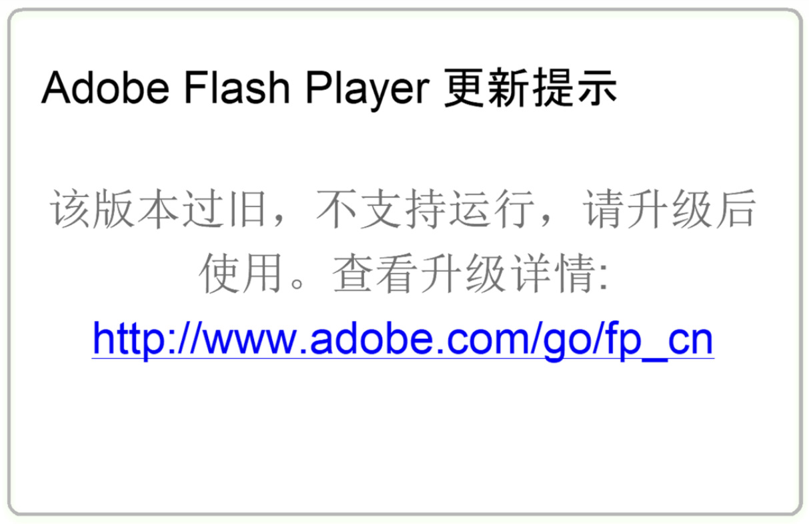

# FlashReable

屏蔽Flash Player检测中国ip强制下载“Flash助手”（中国区特供版）的提示

在不安装Flash助手的情况下正常使用Flash

## 背景



当Flash Player检测到中国ip时，打开flash文件，会跳转到上述页面。

这要求中国区用户接受广告版flash

解决这个问题的方法就是屏蔽它对adobe的访问

通过修改host来达到目的

编写自动化脚本以自动运行

## 使用

下载[脚本](bin/flashreable.bat)并以管理员权限运行即可。

若仍出现提示则请使用[增强脚本](bin/extra_fra.bat)运行。

## 实现

### 删除配置文件

当出现中国区提示时，会生成`settings.sol`配置文件，只要其存在就会提示中国区。

一般该文件位于`C:\Users\%username%\AppData\Roaming\Macromedia\Flash Player\macromedia.com\support\flashplayer\sys`

但也可能在其他位置

默认脚本删除上述位置的`settings.sol`并新建空同名文件且设置为只读。

> 注意：若运行脚本后仍出现提示，可尝试运行增强脚本

增强脚本将全局搜索`settings.sol`。

### 修改Host以屏蔽访问

通过测试，flash通过以下网址实现ip检测。
```
flash.cn
geo2.adobe.com
macromedia.com
fpdownload.macromedia.com
fpdownload2.macromedia.com
```

于Host文件写入以下内容将对以上网址的访问转发至127.0.0.1(无效访问)
```
127.0.0.1 flash.cn
127.0.0.1 geo2.adobe.com
127.0.0.1 macromedia.com
127.0.0.1 fpdownload.macromedia.com
127.0.0.1 fpdownload2.macromedia.com
```
